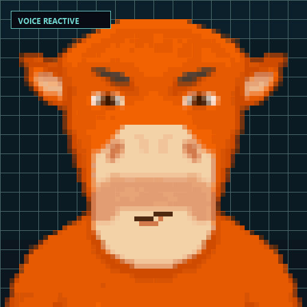
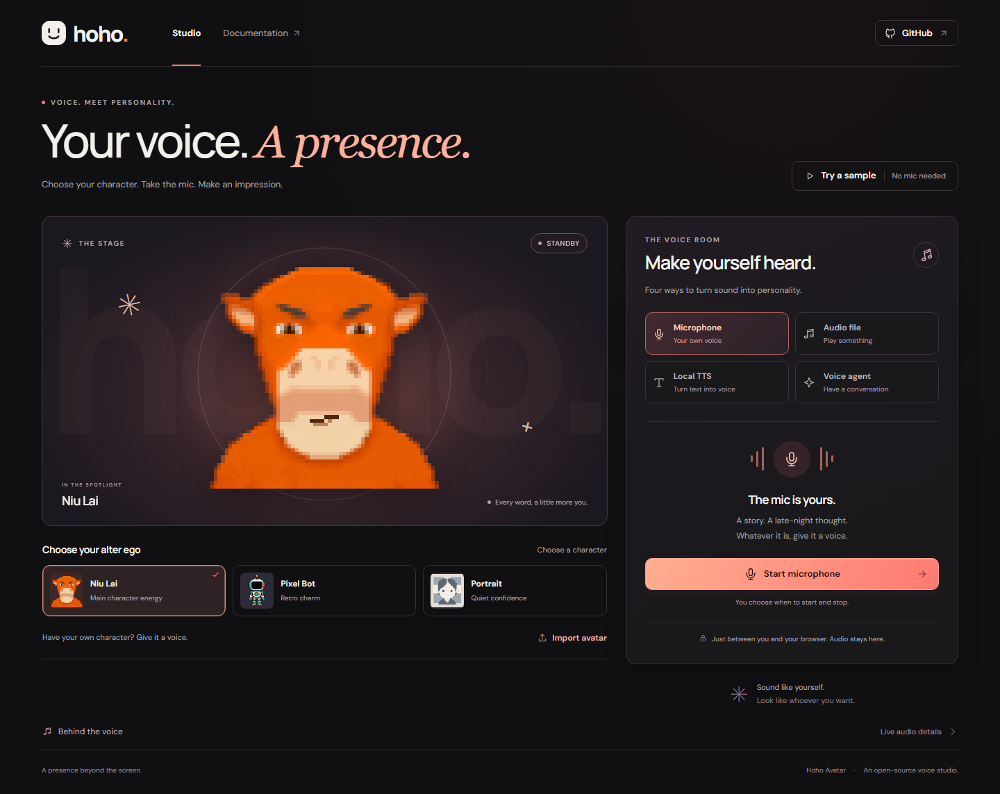

# Hoho Avatar

Hoho Avatar is an open-source toolkit for building speaking and audio-reactive avatar experiences across rendering engines.

**[Try the live microphone and local audio demo](https://hh1st.github.io/hoho-avatar/)**



Click **TRY SAMPLE VOICE** in the live demo to see Niu Lai react immediately—no microphone permission or audio file required.



_The browser demo with Niu Lai loaded as the default audio-reactive avatar._

The project currently ships a browser-first TypeScript engine that analyzes streaming PCM audio, selects five mouth states, adds automatic blinking, and renders layered PNG characters with Canvas 2D. The demo accepts microphone input, a local audio file, locally generated English speech from KittenTTS, or an optional Azure Realtime voice-agent session. Local audio analysis, file decoding, and KittenTTS stay in the browser; Voice Agent mode explicitly sends microphone audio to the configured Azure OpenAI resource.

Support for additional 2D, Live2D, and 3D renderers is a long-term direction, not a feature of the current release.

## Try it in 60 seconds

Requirements: Node.js 20.19 or newer and npm.

```bash
git clone https://github.com/HH1st/hoho-avatar.git
cd hoho-avatar
npm install
npm run dev
```

Open the URL shown by Vite and press **TRY SAMPLE VOICE**. Everything runs locally in the browser.

## Built for voice agents

Hoho Avatar sits after your audio source: feed it mono PCM from a realtime model, text-to-speech engine, WebSocket, microphone, or prerecorded clip. The rendering layer does not depend on a specific AI provider, so it works well for:

- Browser voice-agent interfaces
- Local assistants and companion apps
- Game dialogue and NPC prototypes
- Streaming overlays and interactive demos

## What is included

| Part | Location | Purpose |
| --- | --- | --- |
| Canvas 2D engine | `src/` | PCM analysis, mouth classification, blinking, asset loading, and Canvas rendering |
| Demo and assets | `examples/basic/`, `public/characters/` | Microphone and local-file playback with three engine-ready example characters |
| Asset Skill | `skills/generate-talking-sprite-character/` | A Codex workflow for generating, validating, previewing, and integrating character assets |

The bundled example characters are:

- `niu-lai` — the default reference-guided orange bovine character.
- `pixel-bot` — the retro robot character.
- `pixel-portrait` — a front-facing pixel-art portrait.

See [ASSETS.md](ASSETS.md) for their licensing and provenance notes.

## Run from source

Select a character and press **START MIC** for live input, **TRY SAMPLE VOICE** for the bundled demo clip, **CHOOSE AUDIO** to decode and play a local audio file, or use **LOCAL TTS // KITTEN** to synthesize English speech. Microphone access normally requires localhost or a secure HTTPS context. KittenTTS requires WebGPU and downloads its Nano model on first use. The demo also serves the complete English phonemizer dictionary locally because the current npm package omits its runtime data assets.

### Load a custom character

The demo accepts a `.zip` containing one V1 character directory. Select **LOAD AVATAR ZIP** or drop the archive onto the avatar stage; the package is validated, unpacked, and rendered entirely inside the browser.

```text
my-character.zip
└── my-character/
    ├── character.json
    ├── body.png
    ├── eyes-open.png
    ├── eyes-closed.png
    └── mouth-{closed,small,large,wide,round}.png
```

Characters produced by the bundled [asset-generation Skill](skills/generate-talking-sprite-character/SKILL.md) follow this layout. Zip the generated character directory before loading it in the demo. The files are not uploaded to a server.

Hoho Avatar is currently source-first and is not published as an npm package. Use the checked-out source directly or adapt the example application for your integration.

## Engine usage from source

The repository entry point is `src/index.ts`. For example, code inside `examples/basic/` imports the engine directly from the source tree and creates a sprite with a canvas, character definition, and PCM sample rate:

```ts
import { TalkingSprite } from "../../src";

const canvas = document.querySelector<HTMLCanvasElement>("#avatar")!;

const sprite = new TalkingSprite(canvas, {
  character: "/characters/niu-lai/character.json",
  sampleRate: 48_000,
});

await sprite.ready;
sprite.start();

// Push mono PCM chunks as they become available.
sprite.pushPCM(float32Chunk);
```

Subscribe to classified motion frames when the surrounding UI needs the current mouth state or energy level:

```ts
const unsubscribe = sprite.onMotion((frame) => {
  console.log(frame.mouth, frame.energy, frame.speaking);
});

// Later:
unsubscribe();
sprite.destroy();
```

### Drive a sprite from a local audio file

`AudioClipPlayer` decodes a complete browser-supported audio file, plays it through Web Audio, and emits mono `Float32Array` PCM chunks for `TalkingSprite`:

```ts
import { AudioClipPlayer, TalkingSprite } from "../../src";

const canvas = document.querySelector<HTMLCanvasElement>("#avatar")!;
const file = document.querySelector<HTMLInputElement>("#audioFile")!.files![0]!;
let sprite: TalkingSprite | undefined;

const player = new AudioClipPlayer({
  onPCM: (chunk) => sprite?.pushPCM(chunk),
  onEnded: () => sprite?.resetAudio(),
});

const metadata = await player.load(file);
sprite = new TalkingSprite(canvas, {
  character: "/characters/niu-lai/character.json",
  sampleRate: metadata.sampleRate,
});

await sprite.ready;
sprite.start();
await player.play();

// Later:
player.stop();
sprite.resetAudio();
await player.destroy();
sprite.destroy();
```

`metadata.sampleRate` is the Web Audio processing rate used by the emitted PCM, so pass it to `TalkingSprite`. Browsers automatically resample source files such as 16 kHz or 24 kHz audio to the `AudioContext` rate. Supported file containers and codecs depend on the browser.

### Drive a sprite from streaming TTS text

`StreamingTTSPlayer` accepts complete text or text deltas, groups them into short speakable phrases, starts playback as soon as the first phrase is ready, synthesizes later phrases while audio is playing, and sends playback PCM through the same avatar input. Supply any synthesizer that returns a browser-decodable audio `Blob`:

```ts
import { StreamingTTSPlayer, TalkingSprite } from "../../src";
import { textToSpeech } from "kitten-tts-webgpu";

const tts = new StreamingTTSPlayer({
  synthesize: (text, options) => textToSpeech(text, {
    model: "nano",
    voice: options.voice,
    speed: options.speed,
    onProgress: options.onProgress,
  }),
  voice: "Bella",
  onPCM: (chunk) => sprite.pushPCM(chunk),
});

// Call prepare() from a click/tap to unlock Web Audio.
await tts.prepare();

// Feed deltas from a streaming model response.
tts.write("Hello! ");
tts.write("This sentence can be synthesized while more text arrives. ");
tts.flush();

// Interrupt playback and discard pending text/audio.
tts.stop();
```

KittenTTS currently supports English only. It produces one WAV per phrase rather than raw audio frames; `StreamingTTSPlayer` provides low-latency queued playback, not model-native streaming synthesis.

The demo exposes two playback policies. **SMOOTH** calls `speakComplete()` and waits for one complete synthesis so playback cannot underrun. **FAST START** calls `speak()` and begins after the first short phrase, but may pause if the current device synthesizes slower than audio plays.

KittenTTS does not expose cancellation for an in-flight WebGPU generation. `stop()` immediately silences and clears scheduled playback, then reports `stopping` until the current synthesis call returns. New synthesis is rejected during that interval so GPU jobs cannot overlap and corrupt playback state.

### Azure Realtime voice agent

The demo can also run a full-duplex voice conversation through Azure OpenAI Realtime. The browser connects only to the included gateway; the gateway obtains an Entra token through Managed Identity and never exposes it to browser code. Copy `.env.example` to `.env` and set `AZURE_OPENAI_DOMAIN` and `AZURE_OPENAI_REALTIME_DEPLOYMENT` to your own Azure resource and deployment.

The gateway runtime uses three continuously running asynchronous loops separated by two queues. The Input Loop normalizes browser and Realtime events into the input queue; the Process Loop transforms those events and places browser-facing events in the output queue; the Output Loop independently delivers audio, transcript, and interruption events. Each response is tagged with a generation so output arriving after an interruption is discarded. The browser remains a thin input/output adapter, and avatar rendering only consumes the PCM that is actually played.

Give the deployed identity the Azure OpenAI inference role for the resource, then run the two processes:

```bash
npm run dev:voice-agent
npm run dev
```

Production uses system-assigned Managed Identity by default. Set `AZURE_CLIENT_ID` for a user-assigned identity. For local development only, copy `.env.example` to `.env`, set `AZURE_USE_DEFAULT_CREDENTIAL=1`, and authenticate with `az login`; this mode uses `AzureCliCredential` explicitly. Set `VOICE_AGENT_ALLOWED_ORIGINS` to the deployed site origin before exposing the gateway publicly.

Local Vite development connects through the built-in `/voice-agent` proxy. Static production builds, including the GitHub Pages demo, disable the Voice Agent tab unless `VITE_VOICE_AGENT_URL` is explicitly set to a deployed `wss://` gateway URL.

The source entry point exports:

- `TalkingSprite`
- `PCMAnalyzer`
- `MouthClassifier`
- `AudioClipPlayer`
- `AudioQueuePlayer`
- `StreamingTTSPlayer` and `takeTTSChunks`
- `VuiClient` and `StreamingPCMPlayer`
- `parseCharacterDefinition` for validating untrusted character JSON
- TypeScript definitions for character configuration, audio features, mouth states, and motion frames

## Character asset format

Each character is a directory containing one body image, optional eye layers, five required mouth layers, and a `character.json` file:

```text
my-character/
├── body.png
├── eyes-open.png
├── eyes-closed.png
├── mouth-closed.png
├── mouth-small.png
├── mouth-large.png
├── mouth-wide.png
├── mouth-round.png
└── character.json
```

The renderer draws layers in this order:

```text
body -> eyes -> mouth
```

Minimal configuration:

```json
{
  "version": 1,
  "canvas": { "width": 512, "height": 512 },
  "body": {
    "src": "body.png",
    "x": 0,
    "y": 0,
    "width": 512,
    "height": 512
  },
  "mouth": {
    "anchor": { "x": 256, "y": 338 },
    "sprites": {
      "closed": "mouth-closed.png",
      "small": "mouth-small.png",
      "large": "mouth-large.png",
      "wide": "mouth-wide.png",
      "round": "mouth-round.png"
    }
  },
  "eyes": {
    "anchor": { "x": 256, "y": 256 },
    "sprites": {
      "open": "eyes-open.png",
      "closed": "eyes-closed.png"
    }
  },
  "animation": { "bodyBouncePx": 2 }
}
```

Image paths are resolved relative to `character.json`. Anchors are the center points of their corresponding transparent PNG layers. See [the complete V1 format guidance](skills/generate-talking-sprite-character/references/character-format.md) for details.

## Generate an asset with Codex

The repository includes the reusable `generate-talking-sprite-character` Skill. It supports both reference-guided and text-only generation.

From a reference:

```text
Use $generate-talking-sprite-character from skills/generate-talking-sprite-character
to create a pixel-art avatar from this reference image and add it to the demo.
```

Without a reference:

```text
Use $generate-talking-sprite-character from skills/generate-talking-sprite-character
to create a friendly pixel-art astronaut cat that can speak, validate the full
eye-and-mouth state matrix, and add it to the demo.
```

The Skill guides Codex through body generation, style-aware eyes and mouth states, configuration, complete state-matrix review, validation, and optional demo integration. Its helper scripts require Python 3 and Pillow:

```bash
python -m pip install -r skills/generate-talking-sprite-character/requirements.txt
```

Image generation also requires an ImageGen capability when a character body does not already exist.

## Development

```bash
npm run dev        # Start the browser demo from source
npm run typecheck  # Type-check source, examples, and tests
npm test           # Run deterministic engine and audio-player tests
npm run build      # Build the browser demo
```

Project layout:

```text
src/
├── animation/   # Blink timing
├── audio/       # PCM feature extraction and mouth classification
├── audio-source/ # Local-file playback and AudioWorklet PCM output
├── core/        # TalkingSprite API and public types
└── renderer/    # Asset loading and Canvas composition

examples/basic/  # Browser microphone demo
public/characters/
├── niu-lai/
├── pixel-bot/
└── pixel-portrait/

skills/generate-talking-sprite-character/
├── SKILL.md
├── references/
├── scripts/
└── assets/

docs/
└── BACKLOG.md      # Deferred packaging and renderer work
```

### Architecture

The engine keeps media acquisition, motion analysis, and drawing as separate stages:

```text
microphone / audio file / TTS
              |
              v
        mono Float32 PCM
              |
              v
 PCMAnalyzer -> MouthClassifier -> TalkingSprite -> SpriteRenderer
                                      |
                               BlinkController
```

`audio-source/` owns browser playback and emits PCM without depending on avatar rendering. `audio/` is DOM-independent signal processing. `core/` defines the public orchestration and validated character model, while `renderer/` owns Canvas and image loading. Keep new integrations on these boundaries: audio providers should emit PCM, classifiers should emit `MotionFrame`, and renderers should consume motion rather than control playback.

## Privacy and browser support

The engine processes PCM data in the browser. Local microphone visualization and selected audio files are not uploaded. When the user explicitly starts Voice Agent mode, the example streams microphone audio through the Managed Identity gateway to the configured Azure OpenAI Realtime deployment and renders the returned audio transcript.

Applications embedding the engine remain responsible for how they acquire, store, or transmit audio outside the engine.

The engine targets modern browsers with Canvas 2D, `fetch`, and `requestAnimationFrame`. The microphone path additionally requires `getUserMedia` and currently uses the legacy `ScriptProcessorNode`. Local-file playback requires `decodeAudioData` and `AudioWorklet`.

## Current scope and roadmap

Current release:

- Browser Canvas 2D rendering
- Mono PCM input
- Local audio-file playback with mono PCM output
- Five heuristic mouth states: `closed`, `small`, `large`, `wide`, and `round`
- Automatic two-state blinking
- Layered PNG character assets

The current engine is not phoneme-level lip sync, a skeletal animation system, or a general-purpose audio recording library.

Longer term, Hoho Avatar aims to expose shared audio-driven motion data to multiple renderer adapters, including richer 2D, Live2D, and 3D integrations. Those adapters are not yet implemented.

Packaging, release automation, dependency reproducibility, and renderer expansion are tracked in [docs/BACKLOG.md](docs/BACKLOG.md).

## Contributing and security

See [CONTRIBUTING.md](CONTRIBUTING.md) before opening a pull request. Report security-sensitive issues according to [SECURITY.md](SECURITY.md).

## License

Hoho Avatar is available under the [MIT License](LICENSE). The engine source, bundled Skill, documentation, and included example assets are covered unless a file states otherwise. See [ASSETS.md](ASSETS.md) for asset-specific notes.
